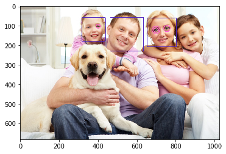
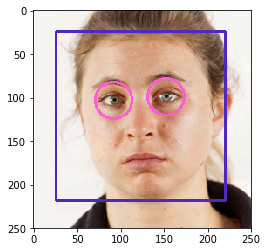
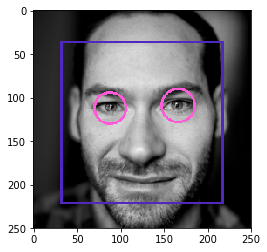
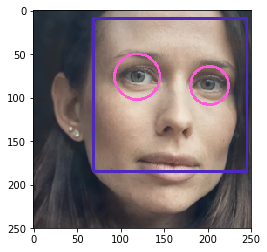
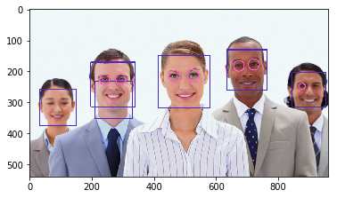
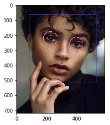

# Face Detection Using OpenCV

## 1- Introduction:  
In this task I used OpenCV to detect humen faces in images in Python.  

## 2- OpenCV:  
It is an open source computer vision library, OpenCV provides a pre-trained models.  

## 3- Detect Humen Faces in image using OpenCV: 
I used pretrained Haar cascade models to detect faces and eyes in an image, we need to download the trained classifier XML file (haarcascade_frontalface_alt.xml)and (haarcascade_eye_tree_eyeglasses.xml), which is available in OpenCv’s GitHub repository (https://github.com/opencv/opencv/tree/master/data/haarcascades).and save it to your working location. 

### <li> Libraries:</li> 
1- <b>cv2 Library:</b> OpenCV library. 
2- <b>Numpy Library:</b> to search for the row and column values of the face NumPy ndarray. This is the array with the face rectangle coordinates. 
3- <b>glob Library:</b> is used to retrieve files/pathnames matching a specified pattern. 
4- <b>matplotlib Library:</b> to draw rectangle an circular around faces and eyes that detect in the image. 

### <li>Steps:</li>
1- Import all necessary libraries. 
2- Load filenames for human images.  
3- Extract pre-trained face and eye detectors.  
4- Convert the color images to grayscale it is important step because detection works only on grayscale images. 
5- Find faces and eyes in image using detectMultiScale function.
6- Get bounding box for each detected face and eye: Each face contains a set of coordinate for the rectangle regions where faces were found. We use these coordinates to draw the rectangles in our image.

_______________________________________________________________________________________________

# الكشف عن الوجوة البشرية باستخدام OpenCV

## ١- المقدمة :  
لإتمام هذه المُهمة قمت باستخدام مكتبة OpentCV 
بلغة البايثون

## ٢- OpenCV:  
 هي عباره عن مكتبة مفتوحة المصدر تُستخدم لتنفيذ تطبيقات مجال رؤية الحاسب كما توفر عدد من النماذج التي تعرف ب
 pre-trained model.

## ٣- Detect Humen Faces in image using OpenCV: 
في هذا المشروع قمت باستخدام النموذج :
Haar cascade models
للكشف عن الوجوه والأعين الموجودة في الصور، ولاستخدامها نحتاج لتحميلها أولاً كملف xml
وفي هذا المشروع قمت بتحميل الملفين :
(haarcascade_frontalface_alt.xml) and (haarcascade_eye_tree_eyeglasses.xml)
 من الرابط التالي:
 (https://github.com/opencv/opencv/tree/master/data/haarcascades)
 بعد ذلك قمت بحفظه في موقع العمل.
 
 ### <li> المكتبات المستخدمه:</li>
 1- <b>cv2 Library:</b> OpenCV مكتبة. 
2- <b>Numpy Library:</b> نحتاج هذه المكتبة للبحث عن الوجوة في الصورة،وذلك لأن الوجوة الموجودة عبارة عن مصفوفة (عدد من الصفوف والأعمدة) ونستخدم هذه الاحداثيات لتحديد واكتشاف منطقة الوجة في الصورة .  
3- <b>glob Library:</b> تستخدم للبحث عن مسار مجلد الصور . 
4- <b>matplotlib Library:</b> لرسم المستطيل والدائرة حول الوجة والأعين التي تم اكتشافها في الصورة. 

## Refrences:

1- How to set up your computer to work with the OpenCV library: https://docs.opencv.org/master/df/d65/tutorial_table_of_content_introduction.html 
2- Face Detection in 2 Minutes using OpenCV & Python: https://towardsdatascience.com/face-detection-in-2-minutes-using-opencv-python-90f89d7c0f81   
3- Cascade Classifier: https://docs.opencv.org/master/db/d28/tutorial_cascade_classifier.html 
